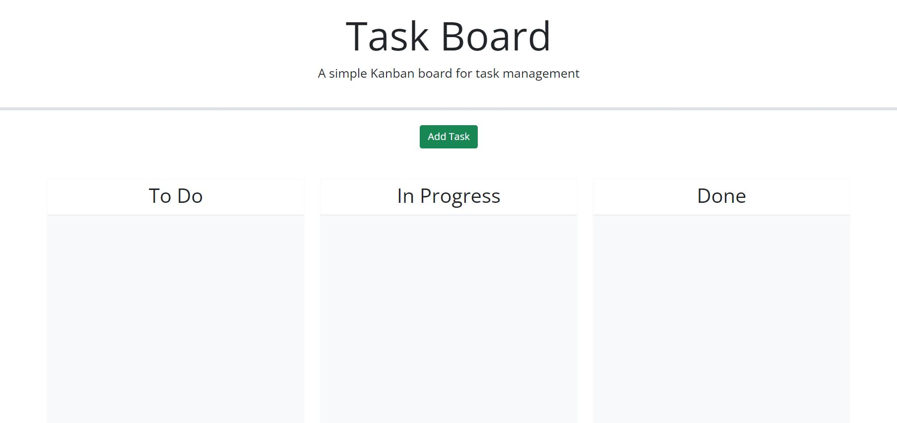

# Task Board App

## Description
A simple task board application that allows a team to manage project tasks by modifying starter code. This app will run in the browser and feature dynamically updated HTML and CSS powered by jQuery. I built it with the intention to provide users with an app that has the functionality to keep track of their tasks. This app allows users to input a task along with the deadline and helps them keep track of each task's progress towards completion. By building this project I learned that it's important in life as well as in software development to be organized and break down tasks in small parts in order to tackle larger projects.

## Table of Contents
- [Installation](#installation)
- [Usage](#usage)
- [Credits](#credits)
- [License](#license)
- [How to Contribute](#how-to-contribute)
- [Tests](#tests)

## Installation
This project does not require an installation. However, you are welcome to to either clone the repository and access the project files or fork the repo.

## Usage
Deployed on [Github Pages](https://andresalbornozgil.github.io/task-board-app/)

Once at the landing page you will see a green button to add a task in the center/upper section of the page. If you click this "Add Task" button, you will be prompted to input a task, deadline date, and description of the task. Once you complete the form, click on the "Add Task" buttom at the bottom of the form. Then you task will appear in the form of a card in the left side of the screen inside the "To do" column.

From this point forward, you can either create more tasks and even drag the cards containing the tasks from one column to another. Notice the cards will change colors depending on the column they are as well as the task's corresponding deadline.

## Credits
Andres Albornoz

## License
This project is unlicensed.

## How to Contribute
Currently there is no need for contribution.

## Tests
Tested at the time of deployment.
